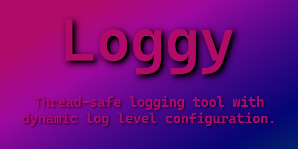
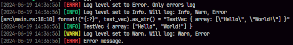

<p align="center">
  <br>
  <b>Simple thread-safe logging tool with dynamic log level configuration.</b>
</p>

Logging works in an hierarchy from Info > Warn > Error. If the log level is set to one of these only self and lower would log. Example:

```r
LogLevel::Info = Info, Warn, Error
LogLevel::Warn = Warn, Error
LogLevel::Error = Error
```

You can also use both info/warn/error() and log(LogLevel::Level, message) for logging depending on your preference

# Quickstart

```rs
use loggy::{LogLevel, LOGGER};

#[macro_use]
extern crate loggy;

fn main() {
    info!("Hello World!");
}
```

# Example usage

```rs
use loggy::{LogLevel, LOGGER};

#[macro_use]
extern crate loggy;

#[derive(Debug)]
struct TestVec {
    array: Vec<String>,
}

fn main() {
    // * Standard use

    LOGGER.set_log_level(LogLevel::Error);

    LOGGER.info("Info message that wont display!");

    LOGGER.set_log_level(LogLevel::Info);

    LOGGER.info("LogLevel set to Info!");
    LOGGER.warn("Warn message!");

    // * Or using macros

    info!("Info message using macro");

    LOGGER.set_log_level(LogLevel::Error);
    LOGGER.info("LogLevel set to Error!");

    warn!("Warn using macro that wont display!");
    error!("Error using macro");

    LOGGER.set_log_level(LogLevel::Info);
    LOGGER.info("LogLevel set to Info!");

    info!("Hello World!");

    let test_vec = TestVec {
        array: vec!["Hello".to_string(), "World!".to_string()],
    };

    info!(dbg!(format!("{:?}", test_vec).as_str()));
    warn!("Whoops!");
    info!("Hello World!");
}


```

## Outputs:


