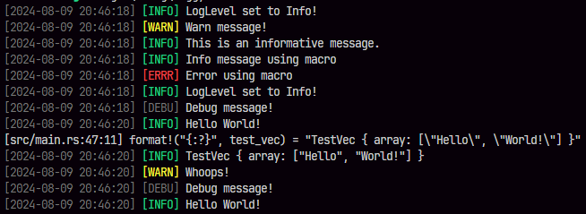

<p align="center">
  <br>
  <b>Simple thread-safe logging tool with dynamic log level configuration.</b>
</p>

Logging works in an hierarchy from Info > Warn > Error. If the log level is set to one of these only self and lower would log. Example:

```r
LogLevel::Info = Info, Warn, Error
LogLevel::Warn = Warn, Error
LogLevel::Error = Error
```

You can also use both info/warn/error() and log(LogLevel::Level, message) for logging depending on your preference

# Example usage

```rs
use loggy::{error, info, log, set_log_level, warn, LogLevel};

#[derive(Debug)]
struct TestVec {
    array: Vec<String>,
}

fn test() {
    set_log_level(LogLevel::Info);

    info("Log level set to Info. Will log: Info, Warn, Error");

    let test_vec = TestVec {
        array: vec!["Hello".to_string(), "World!".to_string()],
    };

    info(dbg!(format!("{:?}", test_vec).as_str()));

    set_log_level(LogLevel::Warn);
    warn("Log level set to Warn. Will log: Warn, Error");
    info("This Info won't log");
    error("Error message.")
}

fn main() {
    set_log_level(LogLevel::Error);

    log(LogLevel::Error, "Log level set to Error. Only errors log");
    log(LogLevel::Info, "This Info won't log.");
    log(LogLevel::Warn, "This Warn won't log.");

    test();
}

```

## Outputs:



